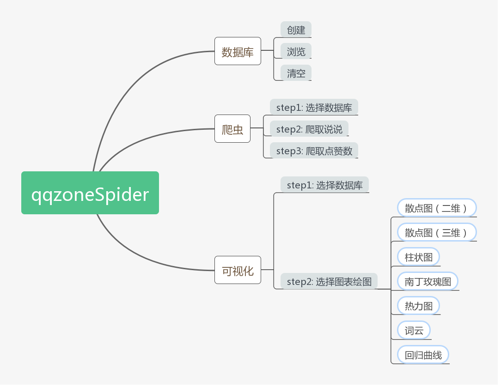
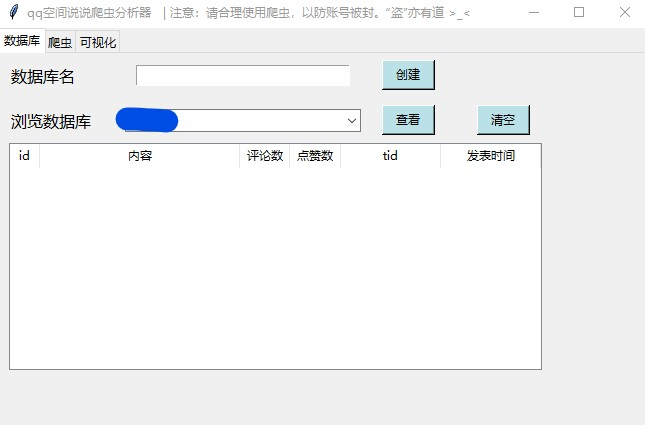
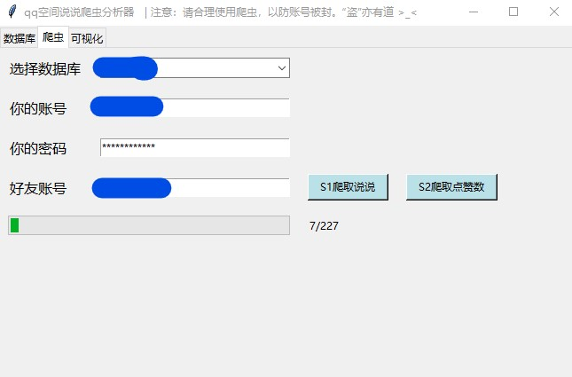
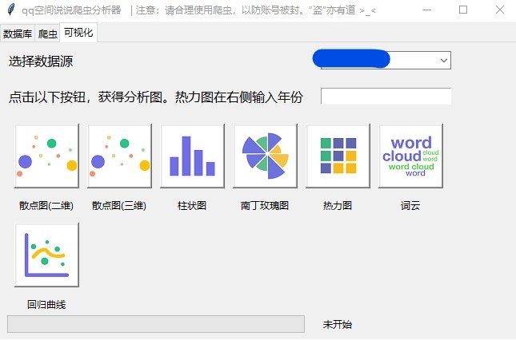

# qqzoneSpider

**an interesting spider program (with GUI)  for collecting your qqzone information or your qq friends'**
 _这是一款有趣的爬虫程序，用于收集你或者你qq好友的空间信息_

## 目录

* `chart/` 存放可视化的结果文件(\*.html)
* `db/` 存放数据库文件(\*.db)以及账号信息文件(account.txt)
* `img/` 存放GUI的图片
* `intro/` 存放README.md中用到的图片
* `phantomjs-2.1.1-windows/` 存放phantomjs可执行程序
* `__init__.py` 主模块
* `dbopr.py` 数据库操作模块
* `spider.py` 爬虫模块
* `visualization.py` 可视化模块
* `stopword.dat` 说说内容剔除字符串列表文件，来源[垃圾短信词频统计](https://github.com/shaonianruntu/SMS-Spam-Word-Frequency-Statistics "垃圾短信词频统计")，有所修改

## 安装

#### 环境

Windows 10

#### Python版本

`Python 3.7.1`

#### 相关库

###### 爬虫相关

* requests 2.20.0
* selenium 3.141.0

###### 数据库相关

* sqlite3（python3.7自带，无需下载）

###### GUI相关

* tkinter（python3.7自带，无需下载）
* webbrowser（python3.7自带，无需下载，用于打开可视化的网页）

###### 可视化相关

* pyecharts 0.5.11（使用旧版，与新版完全不兼容，所以不要安装1.0版本）

###### 数据分析相关

* numpy 1.15.4
* scikit-learn 0.20.3（线性回归）
* jieba 0.39（中文分词）

*Tip：* 所有库可直接用`pip install 库名==版本号`进行下载

## 使用说明

#### 操作步骤

1. 安装好所有的依赖库

2. 在控制台中切换目录至/qqzoneSpider/

输入命令，启动程序界面

	python __init__.py

启动后的主界面如图所示

3. 在“数据库名”后输入用于存储爬取的空间信息的数据库名称，只能用`英文`，而且一个数据库只能存储一个用户的信息，建议用待爬用户相关信息作为库名，如张三可以用zs作为库名，输入后点“创建”，会提示“创建成功！”

4. 点击上方栏“爬虫”，进入爬虫界面。选择一个创建好的数据库，输入`你的qq账号`（会存储在文件中，避免今后重新输入），输入`你的qq密码`，输入你`想要爬取的qq账号`，点击“S1爬取说说”，爬虫开始爬取说说、评论数、tid、发表时间。如图

5. 等爬取完毕后，再点击“S2爬取点赞数”，注意4和5步骤不能颠倒，因为5是根据4得到的说说进行点赞数的爬取！这样所有爬取工作就完成了。

6. 点击上方栏“可视化”，进入可视化界面。先选择一个有数据的数据库，然后点击下方的图表，绘制完成会在`chart/`文件夹下生成html文件，并且在默认浏览器中自动打开该文件查看可视化结果。初步有7中图表可以选择，如果热力图可以输入想要可视化的年份，例如2018，也可以不输入，默认绘制当前年份。如图

7. 如果想查看爬取的数据，可以回到数据库界面，选择数据库，再点击查看。如果想清除数据，则点击“清空”。

**申明：**
* 该爬虫不存储、发送qq密码，仅存储qq账号以及爬取到的qq空间说说、点赞数、评论数、发表时间、tid。其中，爬取说说、评论数、发表时间、tid为同一个请求，一次获取20个结果，爬取点赞数为一个请求，一次获取一个结果。该爬虫仅能爬取本人或者本人qq好友的空间，对于本人不能访问到的空间是无法爬取的。
* 如果登陆失败，可以先在浏览器中确认是否被封，如果没有被封，可以继续尝试。连接时长超过15秒自动取消，所以可能会误判为登陆失败。
* 不使用软件时请及时关闭窗口，以免浪费线程资源
* 该软件的设计初衷是用于学习、交流和个人娱乐，请勿滥用爬虫（长时间高密度地发送请求会导致空间被封），也不要用爬取的数据做违法、伤害朋友的事情！
* “盗”亦有道 \>\_\<

## 原理

#### 爬虫原理介绍

qq空间页面不是一个静态页面，要获取信息需要动态获取。首先要模拟登陆，这里用到的是无界面浏览器phantomjs，利用selenium调用phantomjs.exe进行模拟登陆，从返回的页面中获取qzonetoken，从返回头中获取cookie信息，然后根据加密函数（spider.py get_g_tk()）对cookie中的p_skey字段进行加密，得到g_tk参数。

接下来有两个核心的请求需要用到：

	https://h5.qzone.qq.com/proxy/domain/taotao.qq.com/cgi-bin/emotion_cgi_msglist_v6

以及

	https://user.qzone.qq.com/proxy/domain/r.qzone.qq.com/cgi-bin/user/qz_opcnt2

第一条请求可以获取到说说的具体内容(con)、说说发表的时间戳(created_time)以及位置信息(lbs)，都可以用来做一些相关的分析和可视化，但无法获取点赞数。这里提取content、cmtnum、tid和created_time。

第二条请求可以获取一些数值指标，例如点赞数、评论数、点赞的人等等。从数据库获取tid，根据它作为参数之一从第2条说说获取点赞数，再更新数据库，完成爬取。

详细的原理可以参考18年我写的博文[通过Python爬取QQ空间说说并通过Pyechart进行可视化分析](https://blog.csdn.net/lyandgh/article/details/82945942 "通过Python爬取QQ空间说说并通过Pyechart进行可视化分析")

#### GUI原理介绍

本爬虫用到的GUI库是python自带的tkinter，我也是刚学，发现非常容易，分享一个自己学习的时候建的repo[Tkinter-simple-demo](https://github.com/ly15927086342/Tkinter-simple-demo "Tkinter-simple-demo")。

学习链接来源[Python GUI Examples (Tkinter Tutorial)](https://likegeeks.com/python-gui-examples-tkinter-tutorial/ "Python GUI Examples (Tkinter Tutorial)")

[Tkinter官方文档](https://docs.python.org/zh-cn/3/library/tk.html "Tkinter官方文档")

#### 可视化原理介绍

可视化用到的是0.5版本的pyecharts，就是Echarts的python库，用法很简单，但要注意0.5和1.0版本完全不兼容，所以只能下载旧版的pyecharts才能正常使用本软件。

[pyecharts0.5官方文档](https://05x-docs.pyecharts.org/#/zh-cn/prepare 'pyecharts0.5官方文档')

界面用到的图表图片来自[iconfont](https://www.iconfont.cn/search/index?q=%E5%9B%BE%E8%A1%A8&page=3 "iconfont")

#### 数据库原理介绍

数据库用到了python自带的sqlite3，使用非常简单，可以参考[sqlite3官方文档](https://docs.python.org/3/library/sqlite3.html 'sqlite3官方文档')

## 结语

本想用pyinstaller打包成可执行文件，解决了大部分bug后最终被pyecharts的一些问题给打败了。这里写下打包过程遇到的问题（包括没解决的）：

1. 用网上的.spec打包方式打包，会出现 no module named typedef

**原因：** numpy版本过高 
**解决方式：** --hidden-import sklearn.neighbors.typedefs

2. 可以打包，运行绘图报错 jinja2.exceptions.TemplateNotFound

**原因：** 找不到对应模板 
**解决方式：** 到pip安装的pyecharts文件夹（site-packages/pyecharts）下找到templates文件夹，把里面的html全都复制到可执行程序的目录下

3. 绘制的html无图

**原因：** html没有引用相应的js文件 
**解决方式：** 到网上下载echarts.common.min.js，放在可执行程序目录下，然后在simple_page.html和simple_chart.html中引用直接引用该js文件，注意相对路径

4. 绘制heatmap和wordcloud缺少js

**原因：** 上面引用的js只是基本图像所需的，像heatmap和wordcloud引用的js不止这一个 
**解决方式：** 试着把所需的js引用了，但是还是显示缺少js。头皮发麻，放弃了，如果有解决了告诉我一声。

